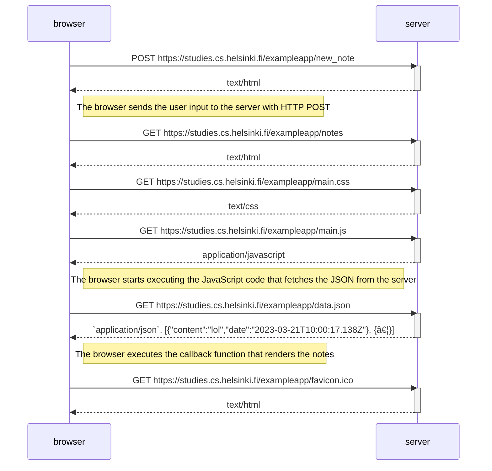

```mermaid
sequenceDiagram
  participant browser
  participant server

  browser->>server: POST https://studies.cs.helsinki.fi/exampleapp/new_note
  activate server
  server-->>browser: text/html
  deactivate server

  Note right of browser: The browser sends the user input to the server with HTTP POST
  
  browser->>server: GET https://studies.cs.helsinki.fi/exampleapp/notes
  activate server
  server-->>browser: text/html
  deactivate server

  browser->>server: GET https://studies.cs.helsinki.fi/exampleapp/main.css
  activate server
  server-->>browser: text/css
  deactivate server

  browser->>server: GET https://studies.cs.helsinki.fi/exampleapp/main.js
  activate server
  server-->>browser: application/javascript
  deactivate server

  Note right of browser: The browser starts executing the JavaScript code that fetches the JSON from the server

  browser->>server: GET https://studies.cs.helsinki.fi/exampleapp/data.json
  activate server
  server-->>browser: `application/json`, [{"content":"lol","date":"2023-03-21T10:00:17.138Z"}, {…}]
  deactivate server

  Note right of browser: The browser executes the callback function that renders the notes

  browser->>server: GET https://studies.cs.helsinki.fi/exampleapp/favicon.ico
  activate server
  server-->>browser: text/html
  deactivate server
```